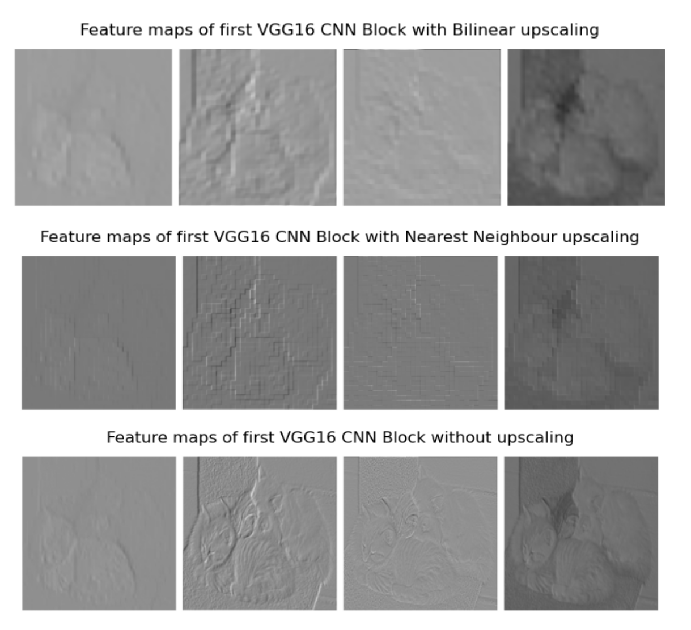
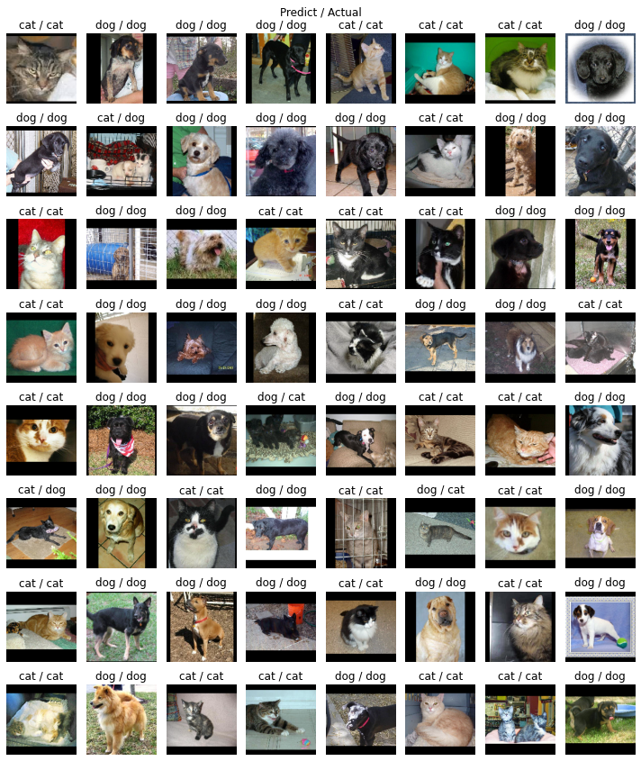
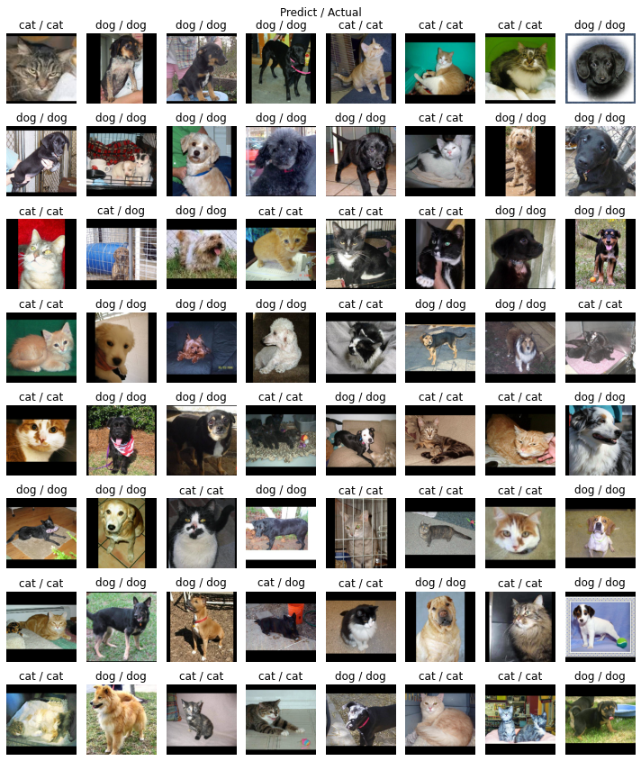

# IE4483-CatDog-and-CIFAR10

A collaboration with my team:
- [**Andy**](https://github.com/iChimmy)
- [**Shen An**](https://github.com/SQUEK011)

This is a project done for IE4483 AI & Data Mining, a course offered by NTU.

## Goal

We have to design & implement a CNN model, either from scratch or through
Transfer Learning, to predict classes of 500 Cat & Dog images.

We implement 2 separate models:

- **ResNet13**, a 13-layer imitation of **ResNet34**.
- **VGG16** through transfer learning.

## Results

|                | Cat Dog Dataset | CIFAR10 |
|----------------|-----------------|---------|
| ResNet13       | 90.0%           | -       |
| ResNet13 (Aug) | 89.7%           | 83.0%   |
| VGG16          | 98.0%           | -       |
| VGG16    (Aug) | 98.0%           | 51.6%   |

See below on explanation of VGG16's poor performance on CIFAR10

## Files

We have 2 notebooks that we used for experimentation.

- `nb.ipynb`: Uses our OOP files defined in `src` to run the experiment
- `nb_standalone.ipynb`: Works on its own, thus can be used outside this environment
- `nb_standalone.nbconvert.ipynb`: A copy of the notebook run by GitHub CI/CD on 1 batch.
   This is used to test cross-platform compatibility.

Running both `nb` and `nb_standalone` should yield the same result.

## VGG16 Transfer Learning poor performance on CIFAR10

We found a significant decrease in performance for VGG16 on CIFAR10, likely due to the fact that we froze the
feature extraction layer. This hinders learning of images of different dimensions.

When we upscaled CIFAR10's 32x32 images, through Nearest Neighbours, we found significant image artifacts,
creating false edges that likely has impacted its learning.

## Sample Predictions

More prediction images can be found under `results/`

| ResNet13                                          | VGG16                                         |
|---------------------------------------------------|-----------------------------------------------|
|   |  |

